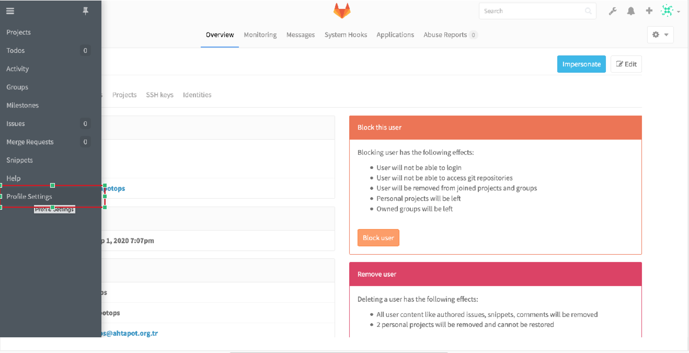
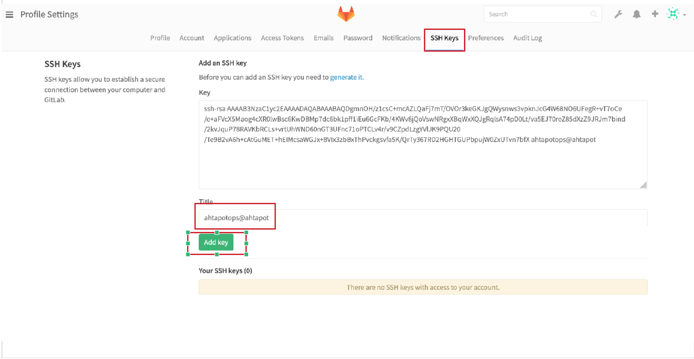
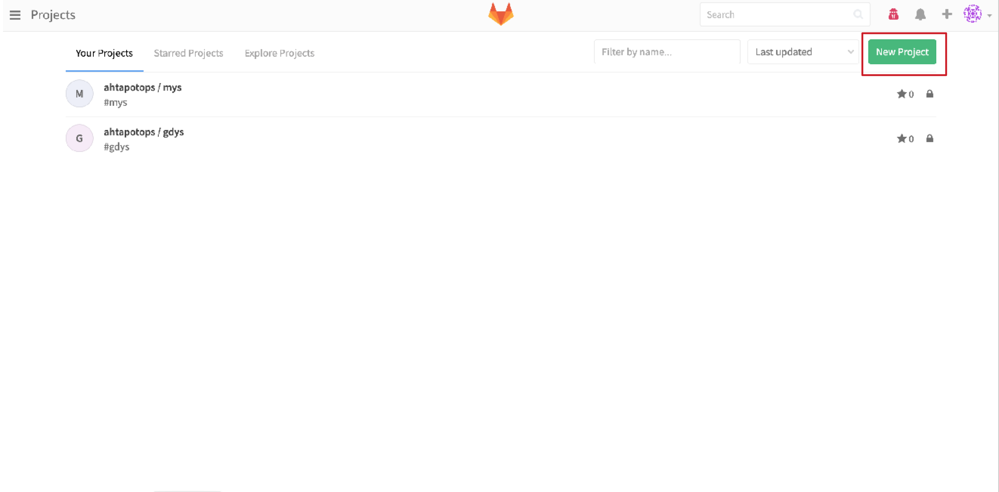
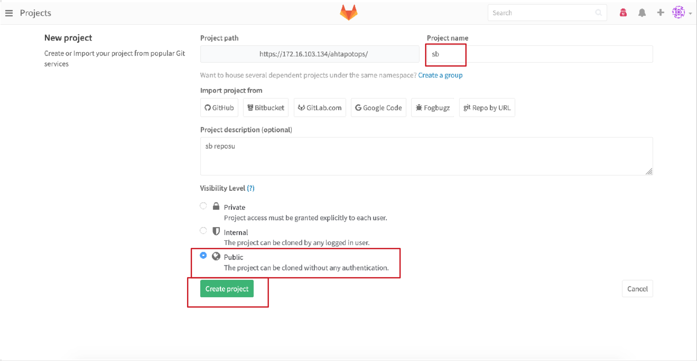
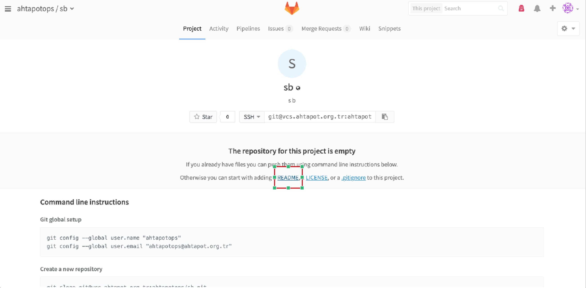
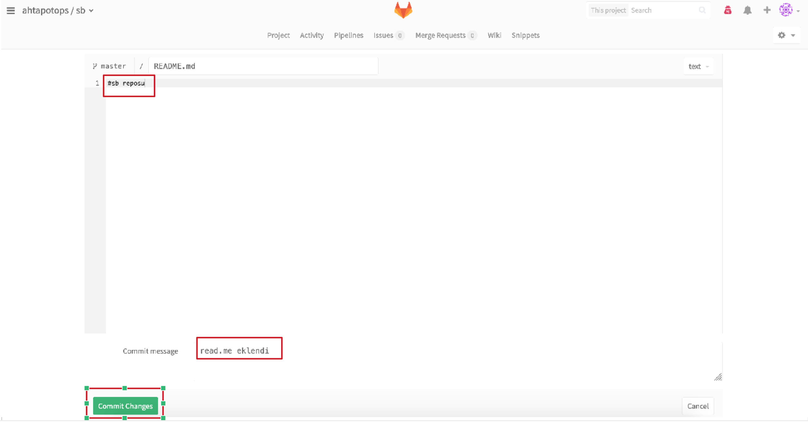

# Merkezi Yönetim Sistemi ve Versiyon Kontrol Sistemi Kurulumları
------

[TOC]


 |   İsterler	|   İşletim Sistemi   |
 |  ----------	|  -----------------  |
 |     MYS	|   Pardus-Ahtapot17  |
 |     VCS	|   Pardus-Ahtapot17  |


### MYS KURULUMU
#### Ansible Kurulum İşlemleri

* [CA Kurulumu ve Anahtar Yönetimi](ca-kurulum.md) dokümanında oluşturulan anahtarlar dokümantasyonda MYS sunucusu üzerinde oluşturulmuştur.

```
$ mkdir -p /home/ahtapotops/.ssh && chmod 700 ~/.ssh
$ touch /home/ahtapotops/.ssh/authorized_keys && cat ahtapotops.pub >> ~/.ssh/authorized_keys
$ cp ahtapotops ~/.ssh/id_rsa && cp ahtapotops.pub ~/.ssh/id_rsa.pub && cp ahtapotops-cert.pub ~/.ssh/id_rsa-cert.pub && chmod 600 ~/.ssh/*
```
* Kurulum, sıkılaştırma vb. gibi işleri otomatize etmeyi sağlayan ansible playbook’ları Ahtapot reposundan ahtapot-mys paketi ile indirilebilir veya Github'tan Ahtapot projesi indirilerek, son güncel ahtapotmys kullanılabilir.
```
$ sudo apt-get install -y ahtapot-mys git
$ git clone -b development https://github.com/Pardus-Ahtapot/MYS.git /tmp/MYS.git && cp -rf /tmp/MYS/ahtapotmys/* /etc/ansible/
$ sudo chown ahtapotops:ahtapotops -R /etc/ansible/
```
Ansible makinası yedekli kurulacak ise, yedek olacak makinanın üzerinde /var/log/ahtapot/ dizini el ile oluşturulup sahipliği ahtapotops kullanıcısı olmalıdır.

* ahtapot_ca.pub dosyasının ansible playbook'lar ile tüm sunuculara dağıtılabilmesi için ilgili playbooktaki **ahtapot_ca.pub.j2** dosyasının içeriği **ahtapot_ca.pub** dosyasının içeriği ile aynı olmalıdır.

```
$ cp /home/ahtapotops/ahtapot_ca.pub /etc/ansible/roles/base/templates/ahtapot_ca.pub.j2
```

* Kullanılacak repo adreslerini eklemek için **/etc/ansible/roles/base/vars/repo.yml** dosyası metin editörü (nano,vi,vim,vb.) ile düzenlenmelidir.

```
$ nano /etc/ansible/roles/base/vars/repo.yml
# Depo degiskenlerini iceren dosyadir.
# Yorum satiri ile gosterilen sablon doldurularak istenilen kadar repo eklenebilir.
base_repositories:
    repo01:
        url: 'deb http://depo.pardus.org.tr/pardus onyedi main contrib non-free'
        updatecache: yes 
        state: present
    repo02:
        url: 'deb http://depo.pardus.org.tr/guvenlik onyedi main contrib non-free'
        updatecache: yes
        state: present
    repo03:
        url: 'deb http://depo.ahtapot.org.tr/ahtapot testing main'
        updatecache: yes 
        state: present
    repo04:
        url: 'deb http://depo.ahtapot.org.tr/ahtapot stable main'
        updatecache: yes
        state: present
    repo05:
        url: 'deb [trusted=yes] http://depo.pardus.org.tr/ahtapot-siem yenikusak main'
        updatecache: yes
        state: present   
#    repoXX:
#        url: 
#        updatecache:
#        state:
```

* Kurmak istediğimiz bileşenlerin bilgileri **/etc/ansible/hosts** ve **/etc/ansible/roles/base/vars/host.yml** dosyalarına yazılması gerekir. Düzenlenmeler yapılırken, sunucuya hangi rol yüklenecek ise **[rol_adı]** satırının altına ilgili sunucusunun **FQDN** bilgileri girilmelidir. Sistemler yedekli kurulacak ise, yedek sistemlerin FQDN bilgileri de ilgili başlık altına yazılmalıdır.

```
$ nano /etc/ansible/hosts

[ansible]
ansible.domain_adi
[gitlab]
gitlab.domain_adi

#[server]
#server1.domain_adi
#örnek;
#[ansible]
#ansible.ahtapot.org.tr
```

```
$ nano /etc/ansible/roles/base/vars/host.yml
# Sunucu değişkenlerini içeren dosyadır.
# Yorum satırı ile gösterilen şablon doldurularak istenilen kadar sunucu eklenebilir.

hosts:
# /etc/hosts yapilandirmasini belirtmektedir.
    conf:
        source: "hosts.j2"
        destination: "/etc/hosts"
        owner: "root"
        group: "root"
        mode: "0644"

base_host_servers:
    server01:
        ip: "X.X.X.X"
        fqdn: "ansible.domain_adi"
        hostname: "ansible"
#    serverX:
#        ip: "X.X.X.X"
#        fqdn: "server.domain_adi"
#        hostname: "server"
#    server01:
#       ip: "X.X.X.X"
#       fqdn: "ansible.ahtapot.org.tr"
#       hostname: "ansible"
```

* Sunucular sanal ortamda kuruluyor ise, **/etc/ansible/roles/base/vars/kernelmodules_remove.yml** ve **/etc/ansible/roles/base/vars/kernelmodules_blacklist.yml** dizinlerindeki modüllerin sanal makina olmamasından kaynaklı hata verebilir. Playbook çalıştıktan sonra hata veren modülü yorum satırı yapabilir veya modülleri kontrol etmek istemiyor iseniz tüm modülleri yorum satırı yapabilir veya silebilirsiniz.
* Sunucular fiziksel ise herhangi bir değişiklik yapmaya gerek yoktur.

```
$ nano /etc/ansible/roles/base/vars/kernelmodules_remove.yml

# Cikarilacak cekirdek modullerini iceren dosyadir.
# Yorum satiri ile gosterilen sablon doldurularak cikarilmak istenilen kadar cekirdek modulu eklenebilir.
# Eklenen cekirdek modullerinin makine her yeniden baslayisinda otomatik eklenmesi engellenir.
# Cikarilacak modul baska bir modul tarafindan kullaniliyorsa ilk olarak KULANAN modul cikarilmalidir.

rem_modules:
    conf:
        source: "kernelmodules_remove.conf.j2"
        owner: "root"
        group: "root"
        mode: "0644"

to_be_removed_modules:
    module01:
        name: "usb_storage"
        state: "absent"

```

* Sunucuların birbirlerinin “**known_host**” dosyasında kayıtlarının olması için “**ahtapotops**” kullanıcısı ile ssh bağlantısı sağlanması gerekmektedir. Bunun için aşağıdaki komutlar ansible makinesinden diğer makinelere doğru çalıştırılmalı ve sunucu anahtarlarının kabul edilmesi sorusu sorulduğunda “yes” yazılmalıdır. Bağlantıda sorun ile karşılaşılması durumunda anahtarların doğruluğu kontrol edilmelidir. 

```
$ ssh-copy-id ansible.fqdn_bilgisi
$ ssh-copy-id mys.ahtapot.org.tr
$ ssh mys.ahtapot.org.tr
$ exit
```
* Playbook oynatıldıktan sonra MYS sunucusuna uzaktan erişim sağlayabilmek için **/etc/ansible/roles/base/vars/ssh.yml** playbook'unda **PasswordAuthentication: "yes"** düzenleme yapılmalıdır. Ansible sunucunuza uzaktan erişim sağlanılmayacaksa düzenleme yapılmasına gerek yoktur.

```
$ nano /etc/ansible/roles/base/vars/ssh.yml

---
# Ssh degiskenlerini iceren dosyadir.
ssh:
    conf:
        source: "sshd_config.j2"
        destination: "/etc/ssh/sshd_config"
        owner: "root"
        group: "root"
        mode: "0600"
    service:
        name: "ssh"
        state: "started"
        enabled: "yes"
    TrustedUserCAKeys:
        source: "ahtapot_ca.pub.j2"
        destination: "/etc/ssh/ahtapot_ca.pub"
        owner: "root"
        group: "root"
        mode: "0644"
    RevokedKeys:
        source: "revoked_keys.j2"
        destination: "/etc/ssh/revoked_keys"
        owner: "root"
        group: "root"
        mode: "0644"
    LocalBanner:
        source: "issue.j2"
        destination: "/etc/issue"
        owner: "root"
        group: "root"
        mode: "0644"
    RemoteBanner:
        source: "issue.net.j2"
        destination: "/etc/issue.net"
        owner: "root"
        group: "root"
        mode: "0644"

    #guvenlik seviyesini arttirmak icin izinli kullanici ve gruplari tanimlayiniz
    AllowUsers: ""
    AllowGroups: ""
    DenyUsers: ""
    DenyGroups: ""

    Port: "22"
    Protocol: "2"
    ListenAddressv4: "0.0.0.0"
    ListenAddressv6: "::"
    UsePrivilegeSeparation: "yes"
    KeyRegenerationInterval: "3600"
    ServerKeyBits: "1024"
    SyslogFacility: "AUTH"
    LogLevel: "INFO"
    LoginGraceTime: "90"
    PermitRootLogin: "no"
    StrictModes: "yes"
    RSAAuthentication: "yes"
    PubkeyAuthentication: "yes"
    IgnoreRhosts: "yes"
    RhostsRSAAuthentication: "no"
    HostbasedAuthentication: "no"
    IgnoreUserKnownHosts: "yes"
    PermitEmptyPasswords: "no"
    ChallengeResponseAuthentication: "no"
    PasswordAuthentication: "no"
    KerberosAuthentication: "no"
    KerberosOrLocalPasswd: "yes"
    KerberosTicketCleanup: "yes"
    GSSAPIAuthentication: "no"
    GSSAPICleanupCredentials: "yes"
    X11Forwarding: "no"
    X11DisplayOffset: "10"
    PrintMotd: "yes"
    PrintLastLog: "yes"
    TCPKeepAlive: "yes"
    UsePAM: "no"
    UseLogin: "no"
    MaxAuthTries: "4"
    PermitUserEnvironment: "no"
    Ciphers: "aes128-ctr,aes192-ctr,aes256-ctr"
    ClientAliveInterval: "300"
    ClientAliveCountMax: "0"
```


* Sunucu üzerinde gerekli sıkılaştırma işlemleri ve ansible kurulumu yapacak olan **ansible.yml** playbook’u açılır ve **roles:** altinda sadece **base** rolü açık kalacak şekilde **ansible** ve **post** rollerinin başına **#** koyulur daha sonra bu dosya aşağıda gösterildiği şekilde çalıştırılır.

```
$ nano /etc/ansible/playbooks/ansible.yml

roles:
  - {role: base}
#  - {role: ansible}
#  - {role: post}
```

```
$ ansible-playbook /etc/ansible/playbooks/ansible.yml

```

### VCS KURULUMU

#### Ansible ile GitLab Kurulumu

* [CA Kurulumu ve Anahtar Yönetimi](ca-kurulum.md) dokümanına göre MYS sunucusunda oluşturulan anahtarlar VCS sunucusuna taşıyınız.
* Git kurulumdan sonra parolasız git işlemlerini yapabilmek için [CA Kurulumu ve Anahtar Yönetimi](ca-kurulum.md) dokümanına uygun bir şekilde oluşturulmuş git kullanıcısına ait anahtalar, GitLab sunucu üzerinde ilgili yerlere kopyalama işlemi yapılmalıdır. Bu adımlar hem GitLab sunucusunda yedekli kurulacak ise yedek GitLab sunucusunda da yapılmalıdır.

```
$ cp ahtapotops ~/.ssh/id_rsa && cp ahtapotops.pub ~/.ssh/id_rsa.pub && cp ahtapotops-cert.pub ~/.ssh/id_rsa-cert.pub
$ touch .ssh/authorized_keys && cat ahtapotops.pub >> .ssh/authorized_keys
$ chmod 700 ~/.ssh
$ cd ~/.ssh/ && chmod 600 /home/ahtapotops/.ssh/*
$ exit
```

```
$ ssh-copy-id gitlab.ahtapot.org.tr
$ ssh ahtapotops@gitlab.fqdn_bilgisi -i /home/ahtapotops/.ssh/id_rsa
$ exit
```

* MYS'de /etc/ansible/hosts ve /etc/ansible/roles/base/vars/host.yml dosyalarında gitlab sunucusu bilgileri düzenlenir.

```
$ nano /etc/ansible/hosts

[ansible]
ansible.domain_adi
[gitlab]
gitlab.domain_adi

```

```
$ nano /etc/ansible/roles/base/vars/host.yml
# Sunucu degiskenlerini iceren dosyadir.
# Yorum satiri ile gosterilen sablon doldurularak istenilen kadar sunucu eklenebilir.

hosts:
# /etc/hosts yapilandirmasini belirtmektedir.
    conf:
        source: "hosts.j2"
        destination: "/etc/hosts"
        owner: "root"
        group: "root"
        mode: "0644"

base_host_servers:
    server01:
        ip: "X.X.X.X"
        fqdn: "ansible.domain_adi"
        hostname: "ansible"
    server02:
        ip: "X.X.X.X"
        fqdn: "gitlab.domain_adi"
        hostname: "gitlab"
```

* ISO’dan kurulumu yapılmış her makinenin ilk planda ssh portları “22” olarak belirlendiğinden dolayı, ansible ilk kurulumu yaparken her makineye 22. Porttan bağlanacaktır.  
* PasswordAuthentication: "no" parametresi sunucuya uzaktan erişimin engellenmesi içindir. Makinanıza uzaktan erişebilmek için "yes" olarak değiştiriniz.

```
$ nano /etc/ansible/roles/base/vars/ssh.yml
    PasswordAuthentication: "yes"
```
* **roles/ansible/vars** klasörü altında git değişkenlerini barındıran **git.yml** dosyası üzerinde **repo01** ve **repo02** başlıkları altındaki **repo** satırında bulunan **yerel_gitlab_adresi** bölümünün yerine Merkezi Yönetim Sistemi kapsamında kurulacak Git sunucusunun adresi girilmelidir. 

```
$ nano /etc/ansible/roles/ansible/vars/git.yml
# Gitin degiskenlerini iceren dosyadir
gitrepos:
    repo01:
        repo: "ssh://git@yerel_gitlab_adresi:ssh_port/ahtapotops/gdys.git"
        accept_hostkey: "yes"
        destination: "/etc/fw/gdys"
        key_file: "/home/ahtapotops/.ssh/id_rsa"
    repo02:
        repo: "ssh://git@yerel_gitlab_adresi:ssh_port/ahtapotops/mys.git"
        accept_hostkey: "yes"
        destination: "/etc/ansible/"
        key_file: "/home/ahtapotops/.ssh/id_rsa"
# örnek
#    repoXX:
#        repo: "ssh://git@gitlab.ahtapot.org.tr:22/ahtapotops/gdys.git"
#        accept_hostkey: ""
#        destination: ""
#        key_file: ""
```

* **/etc/ansible/roles/gitlab/vars/main.yml** dosyası içerisinde  **external_url** satırında bulunan **yerel_gitlab_URL** bölümüne GitLab sunucusunu browser üzerinden çağırırken kullanılması istenilen URL girilmelidir.
* SMTP kullanmayacak iseniz bu ayarları yapmanıza gerek yoktur. GitLab SMTP ayarları için **gitlab_email_from:** satırına GitLab tarafından atılacak bilgilendirme postalarının hangi adres tarafından atılacağı belirtilmelidir. **gitlab_email_display_name:** satırında gönderilen postalarda görünmesi istenilen isim belirlenir. **gitlab_email_reply_to:** satırında GitLab tarafından gönderilen postalara cevap verilmesi durumunda cevabın hangi adrese yönlendirilmesi istendiği belirtilir. **smtp_address:** satırında smtp sunucusunun FQDN ve ya IP adres bilgileri girilir. **smtp_port:** satırında smtp sunucusunun kullandığı port yazılır. **smtp_domain:** satırında ise stmp alan adı bilgisi girilir.
* Gitlab yedekli kullanılacak ise, git altındaki **backup** fonksiyonu altındaki **Server** satırına yedek gitlab sunucusunun FQDN bilgileri **Port** satırına ise ssh port bilgisi girilmelidir. 
* GitLab yedekli kullanılmayacak ise **backup** fonksiyonu altında bulunan **Server** ve **Port** değişkenlerine hiçbir şey yapılmamalıdır. 
* Ansible fonksiyonu altındaki **Server** satırına ansible makinesinin FQDN bilgileri **Port** satırına ise ssh port bilgisi girilmelidir.


```
$ nano /etc/ansible/roles/gitlab/vars/main.yml
# GitLab'in degiskenlerinin tutuldugu dosyadir.
gitlab:
# git kullanicisini yapilandirmasi belirtilmektedir.
    user:
        name: git
        password: "jQCGY1Gp$rVz8u3qRyH3UCB.6MSnWToQv1qQYjYeatbBEA0pA4aqnjoTchjPDsm9CAeuk1xVKoV3MqM1C/UJZ6Fgap9XmB0"
        state: present
    service:
        name: gitlab-runsvdir
        state: started
        enabled: yes
    conf:
        source: gitlab.rb.j2
        destination: /etc/gitlab/gitlab.rb
        owner: root
        group: root
        mode: 0640
    ssl:
        directory:
            path: /etc/gitlab/ssl
            owner: root 
            group: root 
            mode: 700
            state: directory 
            recurse: no 
    ssl-crt:
        source: ssl-crt.j2
        destination: /etc/gitlab/ssl/gitlab.gdys.local.crt
        owner: root
        group: root
        mode: 600
    ssl-key:
        source: ssl-key.j2
        destination: /etc/gitlab/gitlab.gdys.local.key
        owner: root
        group: root
        mode: 600
    external_url: https://yerel_gitlab_URL
    firstrunpath: /var/opt/gitlab/bootstrapped
    gitlab_rails:
        gitlab_email_enabled: "true"
        gitlab_email_from: gitlab@Domain_Adi 
        gitlab_email_display_name: GdysGitlab 
        gitlab_email_reply_to: no-reply@Domain_Adi
        gitlab_default_theme: 2
        gitlab_shell_ssh_port: 22
        smtp_enable: "true" 
        smtp_address: smtp_sunucu_adı
        smtp_port: 25 
        smtp_domain: domain_adi
        smtp_tls: "false" 
    nginx:
        enable: "true"
        redirect_http_to_https: "true"
    backup:
        Server: gitlab.domain_adi
        Port: 22
    ansible:
        Server: ansible.domain_adi
        Port: 22
```

* GitLab yedekli kurulmayacak ise, Ansible playbook üzerinde bulunan yedek GitLab için yapılacak işlemler gitlab rolünden kaldırılır. **/etc/ansible/roles/gitlab/templates/** dizini altında bulunan **post-receive-gdys.sh.j2** dosyasında, gdys reposunun güncellenmesini sağlayan ilk komut bırakılarak, backup/restore işlemini tetikleyen diğer satırların başına **#** işareti konularak, komut satırı haline dönüştürülür. 


```
$ nano /etc/ansible/roles/gitlab/templates/post-receive-gdys.sh.j2
#!/usr/bin/env python

## Bu dosya ansible tarafindan yonetilmektedir!
## Burada yapilan degisikliklerin uzerine yazilir!!
{{ ansible_managed }}

import subprocess

subprocess.Popen(["/usr/bin/ssh -o StrictHostKeyChecking=no -o UserKnownHostsFile=/dev/null ahtapotops@{{ gitlab['ansible']['Server'] }} -p {{ gitlab['ansible']['Port']}} -i \"/var/opt/gitlab/.ssh/gdyshook\""], shell=True)

#subprocess.call(["/bin/rm -f /var/opt/gitlab/backups/*.tar"], shell=True)
#subprocess.call(["gitlab-rake gitlab:backup:create"], shell=True)

#subprocess.call(["/usr/bin/ssh -o StrictHostKeyChecking=no -o UserKnownHostsFile=/dev/null git@{{ gitlab['backup']['Server'] }} -p {{ gitlab['backup']['Port']}} \"/bin/bash -c 'rm -f /var/opt/gitlab/backups/*.tar'\""], shell=True)
#subprocess.call(["scp -P {{ gitlab['backup']['Port']}} -o StrictHostKeyChecking=no -o UserKnownHostsFile=/dev/null /var/opt/gitlab/backups/*.tar git@{{ gitlab['backup']['Server'] }}:/var/opt/gitlab/backups/"], shell=True)
#subprocess.call(["/usr/bin/ssh -o StrictHostKeyChecking=no -o UserKnownHostsFile=/dev/null git@{{ gitlab['backup']['Server'] }} -p {{ gitlab['backup']['Port']}} \"/bin/bash -c 'gitlab-rake gitlab:backup:restore force=yes'\""], shell=True)

```

* “**roles/gitlab/templates/**” dizini altında bulunan “**post-receive-mys.sh.j2**” dosyasında, mys reposunun güncellenmesini sağlayan ilk komut bırakılarak, backup/restore işlemini tetikleyen diğer satırların başına “***#**” işareti konularak, komut satırı haline dönüştürülür. 


```
$ nano /etc/ansible/roles/gitlab/templates/post-receive-mys.sh.j2
#!/usr/bin/env python

## Bu dosya ansible tarafindan yonetilmektedir!
## Burada yapilan degisikliklerin uzerine yazilir!!
{{ ansible_managed }}

import subprocess

subprocess.Popen(["/usr/bin/ssh -o StrictHostKeyChecking=no -o UserKnownHostsFile=/dev/null ahtapotops@{{ gitlab['ansible']['Server'] }} -p {{ gitlab['ansible']['Port']}} -i \"/var/opt/gitlab/.ssh/myshook\""], shell=True)

#subprocess.call(["/bin/rm -f /var/opt/gitlab/backups/*.tar"], shell=True)
#subprocess.call(["gitlab-rake gitlab:backup:create"], shell=True)

#subprocess.call(["/usr/bin/ssh -o StrictHostKeyChecking=no -o UserKnownHostsFile=/dev/null git@{{ gitlab['backup']['Server'] }} -p {{ gitlab['backup']['Port']}} \"/bin/bash -c 'rm -f /var/opt/gitlab/backups/*.tar'\""], shell=True)
#subprocess.call(["scp -P {{ gitlab['backup']['Port']}} -o StrictHostKeyChecking=no -o UserKnownHostsFile=/dev/null /var/opt/gitlab/backups/*.tar git@{{ gitlab['backup']['Server'] }}:/var/opt/gitlab/backups/"], shell=True)
#subprocess.call(["/usr/bin/ssh -o StrictHostKeyChecking=no -o UserKnownHostsFile=/dev/null git@{{ gitlab['backup']['Server'] }} -p {{ gitlab['backup']['Port']}} \"/bin/bash -c 'gitlab-rake gitlab:backup:restore force=yes'\""], shell=True)
```

* ISO’dan kurulumu yapılmış her makinenin ilk planda ssh portları **22** olarak belirlendiğinden dolayı, ansible ilk kurulumu yaparken her makineye 22. Porttan bağlanacaktır. Bu sebep ile **ansible.cfg** dosyasında bulunan **remote_port** parametresinin **22** olduğu teyit edilmelidir.

```
$ cd /etc/ansible/
$ sudo vi ansible.cfg
# config file for ansible -- http://ansible.com/
# ==============================================

# nearly all parameters can be overridden in ansible-playbook 
# or with command line flags. ansible will read ANSIBLE_CONFIG,
# ansible.cfg in the current working directory, .ansible.cfg in
# the home directory or /etc/ansible/ansible.cfg, whichever it
# finds first

[defaults]
# some basic default values...

hostfile       = /etc/ansible/hosts
library        = /usr/share/ansible
remote_tmp     = /tmp
pattern        = *
forks          = 5
poll_interval  = 15
sudo_user      = root
#ask_sudo_pass = True
#ask_pass      = True
transport      = smart
remote_port    = ssh_port 
```

* “**Ansible Playbookları**” dokümanında detaylı anlatımı bulunan, sunucu üzerinde gerekli sıkılaştırma işlemleri ve gitlab kurulumu yapacak olan “**gitlab.yml**” playbook’u çalıştırılır. Ancak ilk kurulma mahsus olmak üzere playbook çalıştırılmadan önce "**gitlab.yml**" dosyası açılır ve "**roles**" altında bulunan "**post**" satırının başına **#** işareti konularak ilk kuruluma mahsus bu rolün çalışmaması sağlanır.

```
$ nano /etc/ansible/playbooks/gitlab.yml

roles:
  - {role: base}
  - {role: gitlab}
#  - {role: post}
```
```
$ ansible-playbook /etc/ansible/playbooks/gitlab.yml
```

* git kullanıcısı için anahtarlar GitLab sunucu üzerinde ilgili dizinlere taşınır.

``` 
$ ssh gitlab.fqdn_bilgisi
$ cd /home/ahtapotops/
$ sudo cp /home/ahtapotops/git /var/opt/gitlab/.ssh/id_rsa  
$ sudo cp /home/ahtapotops/git-cert.pub /var/opt/gitlab/.ssh/id_rsa-cert.pub
$ sudo cp /home/ahtapotops/git.pub /var/opt/gitlab/.ssh/id_rsa.pub
$ sudo cp /home/ahtapotops/myshook /var/opt/gitlab/.ssh/myshook  
$ sudo cp /home/ahtapotops/myshook-cert.pub /var/opt/gitlab/.ssh/myshook-cert.pub
$ sudo cp /home/ahtapotops/myshook.pub /var/opt/gitlab/.ssh/myshook.pub
$ sudo cp /home/ahtapotops/gdyshook /var/opt/gitlab/.ssh/gdyshook   
$ sudo cp /home/ahtapotops/gdyshook-cert.pub /var/opt/gitlab/.ssh/gdyshook-cert.pub
$ sudo cp /home/ahtapotops/gdyshook.pub /var/opt/gitlab/.ssh/gdyshook.pub
$ sudo chown git:git /var/opt/gitlab/.ssh/*
$ exit
```
**NOT :** Gitlab yedekli kurulacak ise, yedek sistem üzerinde bu adımlar el ile yapılmalıdır.


#### GitLab Arayüz Yapılandırması

Gitlab yedekli kurulacak ise, yedek sistemin üzerinde arayüz yapılandırma işlemlerinin yapılmasına gerek yoktur.

Yapılandırma işlemlerine geçmek üzere, gitlab adresine bir web tarayıcısı ile girilerek Gitlab web arayüzüne “**https://gitlabsunucuadresi**” ile erişilir. 

* Gitlab arayüzüne girildikten sonra root kullanıcısının parola değiştirme işlemi gerçekleştirilir. En az 8 karakterden oluşacak yeni parola belirlenir.


  * Root kullanıcısı ve belirlenen yeni parola ile giriş yapınız.


  * root kullanıcı için kullanıcı sol taraftan **Profile Settings** seçeneğine tıklayınız. Menüden **SSH Keys** tıklayınız ve gelen sayfada **ADD SSH KEY** butonuna basınız.



  * Ekranda **Key** kısmına **git.pub** dosyasının içeriğini kopyalayınız , **Title** kısmına kullanıcı oluştururken belirttiğimiz posta adresi giriniz. **ADD KEY** butonuna basılarak sisteme ekleyiniz.



  * Sağ üst köşede bulunan **Admin Area** simgesine basarak kullanıcıları oluşturmak için **Yönetici Bölümüne** geçiş yapınız.


  * Yönetici bölümünde **Users** bölümünde yer alan **NEW USER** butonuna basınız.


  * FirewallBuilder kontrol paneli ile iletişimi sağlayarak onay mekanizması yapısı kapsamında Onay Kontrol, Son Onaylanmış Commit ID gibi özelliklerini çalıştıracak API kullanıcısı oluşturulmalıdır. Oluşturulacak kullanıcının isminin **gdysapi** olması önemlidir. Kullanıcıyı oluşturmak için **Name**, **Username** ve **Email** alanları doldurularak **CREATE USER** butonuna basılır. 


  * Kullanıcı oluşturulduktan sonra, ilgili kullanıcıya ait bilgilendirme sayfası açılmaktadır. Bu sayfada kullanıcıya şifre oluşturmak için **EDIT** butonuna basılır.


  * Açılan ekranda **Password** bölümünden **gdysapi** kullanıcı için parola belirlenir ve sayfanın en altında bulunan **SAVE CHANGES** butonuna basılır.


  * **ahtapotops** kullanıcısını oluşturmak için; Sağ üst köşede bulunan **Admin Area** simgesine basarak kullanıcıları oluşturmak için **Yönetici Bölümüne** geçiş yapınız. Yönetici bölümünde **Users** bölümünde yer alan **NEW USER** butonuna basınız. **gydsapi** kullanıcısından farklı olarak bu kullanıcı için parola oluşturmayınız.


  * Oluşturulacak kullanıcının isminin **ahtapotops** olması önemlidir. Bu kullanıcı FirewallBuilder ile Ansible entegrasyonunu ve Ansible'ın yöneteceği sunucular arasında iletişimi sağlamaktadır. Otomatizasyon yapısının çalışabilmesi için yapıyı oluşturacak sunucular arasında parolasız erişim kullanılmalıdır. Bu neden ile kullanıcı oluşturulduktan sonra aşağıdaki adımları takip ederek kullanıcıya ait açık anahtar GitLab sistemine eklenmelidir.


  * Oluşturulan **ahtapotops** kullanıcısına SSH-Key belirtme işlemini yapmak için sağ tarafta görünen **IMPERSONATE** butonuna basınız, uygulamanın **ahtapotops** kullanıcısı olarak kullanmaya başlayacaksınız.


  * Impersonate işleminin başarılı gerçekleştiği sağ üstte bulanan **Impersonate** simgesi ile teyit edildikten sonra gelen ekranda sol taraftan **Profile Settings** seçeneğine tıklayınız.


  * Açılan kullanıcı ayarlarında menüden **SSH Keys** tıklayınız ve gelen sayfada **ADD SSH KEY** butonuna basınız.


  * Ekranda **Key** kısmına **ahtapotops.pub** dosyasının içeriğini kopyalayınız , **Title** kısmına kullanıcı oluştururken belirttiğimiz posta adresi giriniz. **ADD KEY** butonuna basılarak sisteme ekleyiniz. 


  * FirewallBuilder ve Ansible entegrasyonunu sağlıklı olarak gerçekleştirmek için iki adet proje oluşturulması gerekmektedir. FirewallBuilder tarafı için **gdys** Ansible tarafı için ise **mys** ve **sb** projeleri oluşturulmalıdır. Proje oluşturmak için **Go to dashboard** butonuna basılır.


  * Ekranda bulunan **NEW PROJECT** butonuna basarak yeni proje oluşturma işlemi gerçekleştirilir.


  * **NEW PROJECT** butonuna basıldığında gelen ekranda **Project path** satırında **/** ibaresinden sonra proje ismi olan **gdys** yazınız. İsteğe bağlı olarak **Description** bölümüne tanımlama yazılarak **Private** seçiniz ve **CREATE PROJECT** butonuna basınız. GDYS kapsamında açılan tüm GitLab projelerinin **Private** olması zaruridir.


  * Proje oluşturulduktan sonra, açılan ekran proje anasayfası olup; **gdys** deposuna erişim hakkı olacak kullanıcıları belirtlemek için sağ üst **Members** seçeneğinden kullanıcı ve yetkilerini belirleyiniz.


  * GitLab üzerinde oluşturulmuş **gdys** projesi için **gdysapi** ve **ahtapotops** kullanıcıları **People** bölümüne ekleyerek yetkilendiriniz. Yetki seviyesini belirlemek amacı ile **Project Access** bölümünden bu kullancılara **Master** yetkisi verilerek **ADD USERS TO PROJECT** butonuna basınız.


  * **Go to dashboard** butonuna basılarak, ana ekrana gidilerek **NEW PROJECT** butonuna basarak **mys** projesini oluşturunuz. 


  
  * **Project path** satırında **/** ibaresinden sonra proje ismi olan **mys** yazınız. İsteğe bağlı olarak **Description** bölümüne tanımlama yazılarak **Private** seçiniz  ve **CREATE PROJECT** butonuna basınız.


  * sol taraftan **Profile Settings** seçeneğine tıklayınız.

  * Proje oluşturulduktan sonra, açılan ekran proje anasayfası olup; **mys** deposuna erişim hakkı olacak kullanıcıları belirtlemek için sağ üst **Members** seçeneğinden kullanıcı ve yetkilerini belirleyiniz.


  * GitLab üzerinde oluşturulmuş **mys** projesi için **gdysapi** ve **ahtapotops** kullanıcıları **People** bölümüne ekleyerek yetkilendiriniz. Yetki seviyesini belirlemek amacı ile **Project Access** bölümünden bu kullancılara **Master** yetkisi verilerek **ADD USERS TO PROJECT** butonuna basınız.


  * **Go to dashboard** butonuna basılarak, ana ekrana gidilerek **NEW PROJECT** butonuna basarak **sb** projesini oluşturunuz.



  * **Project path** satırında **/** ibaresinden sonra proje ismi olan **sb** yazınız. İsteğe bağlı olarak **Description** bölümüne tanımlama yazılarak **Public** seçiniz  ve **CREATE PROJECT** butonuna basınız.



  * GitLab sayfasından, **ahtapotops/sb** projesine gidiniz. adding **README** satırına basılırak, README dosyasını oluşturunuz.

 

  * Açılan dosya ekranında, ilk satıra yorum olmasını sağlacak şekilde # simgesi konularak açıklama yazabilirsiniz. Commit message bölümüne yapılan işlem yazınız ve COMMIT CHANGES butonuna basınız.

 

  * Onay mekanizmasının yapısı oluşturmak adına GitLab sayfasından, **ahtapotops / gdys** projesine gidiniz. Bu yapıyı oluşturmak için projede iki adet dal oluşturulmalıdır. **master** ve **onay** dalları bu yapıyı sağlamaktadır. Öncelikli olarak **master** dalını oluşturmak için **adding README** satırına basılırak, bir dosya oluşturunuz. Böylelikle master dalı oluşturacaksınız.


  * Açılan dosya ekranında, ilk satıra yorum olmasını sağlacak şekilde **#** simgesi konularak açıklama yazabilirsiniz. **Commit message** bölümüne yapılan işlem yazınız ve **COMMIT CHANGES** butonuna basınız.


  * Oluşturulan **master** dalı aşağıdaki ekranda olduğu gibi gözükmektedir. **Files** butonuna basılarak, projeye ait dosyaların bulunduğu **gdys** dizinine gidiniz.


  * **Files** sayfasında **+** işaretine basılarak **New file** seçeneği seçiniz.


  * **http://docs.ahtapot.org.tr/dosyalar/gdys-fwb/** adresinden indirilerek, içeriği kopyalanan **gdys.fwb** dosyasının içeriği buraya yapıştırınız. **master/** ibaresinden sonraki alana **gdys.fwb**  ve **Commit message** alanına yapılan işlem yazılarak **COMMIT CHANGES** butonuna basılır.


  * **Files** butonuna basılarak, projeye ait dosyaların bulunduğu **gdys** dizinine gidiniz.


  * **Files** sayfasında **+** işaretine basılarak **New directory** seçeneği seçiniz.


  * Açılan ekranda **Directory name** kısmında **files** yazılması zaruridir. **Commit message** bölümüne bilgi yazıldıktan sonra **Target branch**, **master** seçilir ve **CREATE DIRECTORY** butonuna basınız.


  * Dosyayı oluşturduktan sonra menüden **Project** seçilerek **gdys** deposu anasayfaya gidiniz. **+** işaretine basılarak **New branch** ile onay dalı oluşturunuz.


  * Açılan yeni ekranda **Branch name** bölümüne **onay** yazarak **CREATE BRANCH** seçeneğini seçiniz.


  * Ansible’a ait playbookları **mys** deposuna aktarmak için Ansible makinesinde (MYS) aşağıdaki adımları takip ediniz.

  * GitLab üzerinde açılan proje aşağıdaki komut ile GitLab makinesinin yereline alınır.

```
$ cd /tmp
$ git clone ssh://git@gitlab_sunucuadı:ssh_port/ahtapotops/mys.git 
# git clone ssh://git@gitlab.ahtapot.org.tr:22/ahtapotops/mys.git
```
```
Cloning into 'mys'...
## Bu dosya ansible tarafindan yonetilmektedir!
## Burada yapilan degisikliklerin uzerine yazilir!!

#+=+=+=+=+=+=+=+=+=+=+=+=+=+=+=+=+=+=+=+=+=+=+=+=+=+=+=+=+=+=+=+=+=+=+=+=+=+=+=+=+=
#  ________  ___  ___  _________  ________  ________  ________  _________   
# |\     \|\  \|\  \|\___   ___\\     \|\     \|\     \|\___   ___\ 
# \ \  \|\  \ \  \\\  \|___ \  \_\ \  \|\  \ \  \|\  \ \  \|\  \|___ \  \_| 
#  \ \     \ \     \   \ \  \ \ \     \ \   ____\ \  \\\  \   \ \  \  
#   \ \  \ \  \ \  \ \  \   \ \  \ \ \  \ \  \ \  \___|\ \  \\\  \   \ \  \ 
#    \ \__\ \__\ \__\ \__\   \ \__\ \ \__\ \__\ \__\    \ \_______\   \ \__\
#     \||\||\||\||    \||  \||\||\||     \|_______|    \||
#                                                                           
#+=+=+=+=+=+=+=+=+=+=+=+=+=+=+=+=+=+=+=+=+=+=+=+=+=+=+=+=+=+=+=+=+=+=+=+=+=+=+=+=+=
# AHTAPOT tarafindan yonetilen gitlab makinasina erisiyorsunuz !!!
# Tum erisim ve hareketleriniz loglaniyor
#+=+=+=+=+=+=+=+=+=+=+=+=+=+=+=+=+=+=+=+=+=+=+=+=+=+=+=+=+=+=+=+=+=+=+=+=+=+=+=+=+=
warning: You appear to have cloned an empty repository.
```

```
$ cp -rf /tmp/mys/.git /etc/ansible/ && sudo chown -R ahtapotops:ahtapotops /etc/ansible/.git
$ sudo chown -R ahtapotops:ahtapotops /etc/ansible/*
```

```
$ git add --all
$ git config --global user.email “ansible@test.com”
$ git config --global user.name “Ansible Makinesi”
$ git commit -m “MYS ana dosyalari eklendi.” 
$ git push origin master
```
* GitLab kurulumunun tamamlanmasının ardından Ansible sunucusundan SSH bağlantı linki üzerinden **gdys** , **sb** depolarının yerele alınması test edilir.

```
$ cd /tmp 
$ git clone ssh://git@gitlab_sunucuadı:ssh_port/ahtapotops/gdys.git 
$ git clone ssh://git@gitlab_sunucuadı:ssh_port/ahtapotops/sb.git
$ rm -rf /tmp/gdys/ /tmp/sb/
```

**NOT :** Ansible yedekli kurulacak ise, yedek sistemde sadece bu madde adımları aşağıdaki şekilde çalıştırılmalıdır.

```
$ cd /tmp
$ git clone ssh://git@gitlab_sunucuadı:ssh_port/ahtapotops/mys.git
$ cp -rf /tmp/mys/.git /etc/ansible/ && sudo chown ahtapotops:ahtapotops /etc/ansible/.git
$ sudo chown ahtapotops:ahtapotops /etc/ansible/*
```

* **NOT:** Gitlab arayüz yapılandırması tamamlanması ile dökümanda yapılması istenilen değişiklikler gitlab arayüzü yerine terminal üzerinden yapılması durumunda playbook oynatılmadan önce yapılan değişiklikler git'e push edilmelidir.
```
$ cd /etc/ansible
git status komutu ile yapılan değişiklikler gözlemlenir.
$ git status  
$ git add --all
$ git commit -m "yapılan değişiklik commiti yazılır"
$ git push origin master
```

* **ÖNEMLİ:** Gitlab kurulumu tamamlandığına göre bir önceki adım olan MYS kurulumu adımına geri dönülür ve başına **#** işareti koyduğumuz **ansible** ve **post** satırlarının başındaki **#** işareti silinir ve **ansible.yml** yeniden aşağıdaki gibi çalıştırılır.

```
$ ansible-playbook /etc/ansible/playbooks/ansible.yml
```

Ardından yine başına "**gitlab.yml**" dosyası içinde başına **#** işareti koyduğumuz **post** satırının başındaki **#** işareti silinir ve "**gitlab.yml**" yeniden çalıştırılır.

```
$ ansible-playbook /etc/ansible/playbooks/gitlab.yml
```

Bu adımlar sonunda artık gitlab ve ansible rolleri tamamıyla kurulmuş olacaktır ve diğer bileşenlerin kurulumuna geçilebilir.
